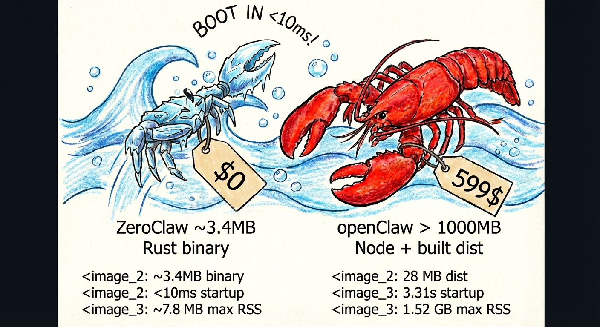

<p align="center">
  
</p>

<h1 align="center">🦀 ZeroClaw — Asistente Personal de IA</h1>

<p align="center">
  <strong>Cero sobrecarga. Cero compromisos. 100% Rust. 100% Agnóstico.</strong><br>
  ⚡️ <strong>Funciona en hardware de $10 con <5MB de RAM: ¡99% menos memoria que OpenClaw y 98% más barato que un Mac mini!</strong>
</p>

<p align="center">
  <a href="LICENSE-APACHE"></a>
  <a href="https://github.com/zeroclaw-labs/zeroclaw/graphs/contributors"></a>
  <a href="https://buymeacoffee.com/argenistherose"></a>
  <a href="https://x.com/zeroclawlabs?s=21"></a>
  <a href="https://www.facebook.com/groups/zeroclawlabs"></a>
  <a href="https://discord.com/invite/wDshRVqRjx"></a>
  <a href="https://www.instagram.com/therealzeroclaw"></a>
  <a href="https://www.tiktok.com/@zeroclawlabs"></a>
  <a href="https://www.rednote.com/user/profile/69b735e6000000002603927e"></a>
  <a href="https://www.reddit.com/r/zeroclawlabs/"></a>
</p>

<p align="center">
Construido por estudiantes y miembros de las comunidades de Harvard, MIT y Sundai.Club.
</p>

<p align="center">
  🌐 <strong>Idiomas:</strong>
  <a href="README.md">🇺🇸 English</a> ·
  <a href="README.zh-CN.md">🇨🇳 简体中文</a> ·
  <a href="README.ja.md">🇯🇵 日本語</a> ·
  <a href="README.ko.md">🇰🇷 한국어</a> ·
  <a href="README.vi.md">🇻🇳 Tiếng Việt</a> ·
  <a href="README.tl.md">🇵🇭 Tagalog</a> ·
  <a href="README.es.md">🇪🇸 Español</a> ·
  <a href="README.pt.md">🇧🇷 Português</a> ·
  <a href="README.it.md">🇮🇹 Italiano</a> ·
  <a href="README.de.md">🇩🇪 Deutsch</a> ·
  <a href="README.fr.md">🇫🇷 Français</a> ·
  <a href="README.ar.md">🇸🇦 العربية</a> ·
  <a href="README.hi.md">🇮🇳 हिन्दी</a> ·
  <a href="README.ru.md">🇷🇺 Русский</a> ·
  <a href="README.bn.md">🇧🇩 বাংলা</a> ·
  <a href="README.he.md">🇮🇱 עברית</a> ·
  <a href="README.pl.md">🇵🇱 Polski</a> ·
  <a href="README.cs.md">🇨🇿 Čeština</a> ·
  <a href="README.nl.md">🇳🇱 Nederlands</a> ·
  <a href="README.tr.md">🇹🇷 Türkçe</a> ·
  <a href="README.uk.md">🇺🇦 Українська</a> ·
  <a href="README.id.md">🇮🇩 Bahasa Indonesia</a> ·
  <a href="README.th.md">🇹🇭 ไทย</a> ·
  <a href="README.ur.md">🇵🇰 اردو</a> ·
  <a href="README.ro.md">🇷🇴 Română</a> ·
  <a href="README.sv.md">🇸🇪 Svenska</a> ·
  <a href="README.el.md">🇬🇷 Ελληνικά</a> ·
  <a href="README.hu.md">🇭🇺 Magyar</a> ·
  <a href="README.fi.md">🇫🇮 Suomi</a> ·
  <a href="README.da.md">🇩🇰 Dansk</a> ·
  <a href="README.nb.md">🇳🇴 Norsk</a>
</p>

ZeroClaw es un asistente personal de IA que ejecutas en tus propios dispositivos. Te responde en los canales que ya usas (WhatsApp, Telegram, Slack, Discord, Signal, iMessage, Matrix, IRC, Email, Bluesky, Nostr, Mattermost, Nextcloud Talk, DingTalk, Lark, QQ, Reddit, LinkedIn, Twitter, MQTT, WeChat Work y más). Tiene un panel web para control en tiempo real y puede conectarse a periféricos de hardware (ESP32, STM32, Arduino, Raspberry Pi). El Gateway es solo el plano de control — el producto es el asistente.

Si quieres un asistente personal, de un solo usuario, que se sienta local, rápido y siempre activo, esto es lo que buscas.

<p align="center">
  <a href="https://zeroclawlabs.ai">Sitio web</a> ·
  <a href="docs/README.md">Documentación</a> ·
  <a href="docs/architecture.md">Arquitectura</a> ·
  <a href="#inicio-rápido">Primeros pasos</a> ·
  <a href="#migración-desde-openclaw">Migración desde OpenClaw</a> ·
  <a href="docs/ops/troubleshooting.md">Solución de problemas</a> ·
  <a href="https://discord.com/invite/wDshRVqRjx">Discord</a>
</p>

> **Configuración recomendada:** ejecuta `zeroclaw onboard` en tu terminal. ZeroClaw Onboard te guía paso a paso en la configuración del gateway, workspace, canales y proveedor. Es la ruta de configuración recomendada y funciona en macOS, Linux y Windows (vía WSL2). ¿Nueva instalación? Empieza aquí: [Primeros pasos](#inicio-rápido)

### Autenticación por suscripción (OAuth)

- **OpenAI Codex** (suscripción ChatGPT)
- **Gemini** (Google OAuth)
- **Anthropic** (clave API o token de autenticación)

Nota sobre modelos: aunque se soportan muchos proveedores/modelos, para la mejor experiencia usa el modelo de última generación más potente disponible. Ver [Onboarding](#inicio-rápido).

Configuración de modelos + CLI: [Referencia de proveedores](docs/reference/api/providers-reference.md)
Rotación de perfiles de autenticación (OAuth vs claves API) + failover: [Failover de modelos](docs/reference/api/providers-reference.md)

## Instalación (recomendada)

Requisito: toolchain estable de Rust. Un solo binario, sin dependencias de runtime.

### Homebrew (macOS/Linuxbrew)

```bash
brew install zeroclaw
```

### Bootstrap con un clic

```bash
git clone https://github.com/zeroclaw-labs/zeroclaw.git
cd zeroclaw
./install.sh
```

`zeroclaw onboard` se ejecuta automáticamente después de la instalación para configurar tu workspace y proveedor.

## Inicio rápido (TL;DR)

Guía completa para principiantes (autenticación, emparejamiento, canales): [Primeros pasos](docs/setup-guides/one-click-bootstrap.md)

```bash
# Instalar + onboard
./install.sh --api-key "sk-..." --provider openrouter

# Iniciar el gateway (servidor webhook + panel web)
zeroclaw gateway                # por defecto: 127.0.0.1:42617
zeroclaw gateway --port 0       # puerto aleatorio (seguridad reforzada)

# Hablar con el asistente
zeroclaw agent -m "Hello, ZeroClaw!"

# Modo interactivo
zeroclaw agent

# Iniciar runtime autónomo completo (gateway + canales + cron + hands)
zeroclaw daemon

# Verificar estado
zeroclaw status

# Ejecutar diagnósticos
zeroclaw doctor
```

¿Actualizando? Ejecuta `zeroclaw doctor` después de actualizar.

### Desde el código fuente (desarrollo)

```bash
git clone https://github.com/zeroclaw-labs/zeroclaw.git
cd zeroclaw

cargo build --release --locked
cargo install --path . --force --locked

zeroclaw onboard
```

> **Alternativa para desarrollo (sin instalación global):** antepón `cargo run --release --` a los comandos (ejemplo: `cargo run --release -- status`).

## Migración desde OpenClaw

ZeroClaw puede importar tu workspace, memoria y configuración de OpenClaw:

```bash
# Vista previa de lo que se migrará (seguro, solo lectura)
zeroclaw migrate openclaw --dry-run

# Ejecutar la migración
zeroclaw migrate openclaw
```

Esto migra tus entradas de memoria, archivos del workspace y configuración de `~/.openclaw/` a `~/.zeroclaw/`. La configuración se convierte de JSON a TOML automáticamente.

## Valores predeterminados de seguridad (acceso por DM)

ZeroClaw se conecta a superficies de mensajería reales. Trata los DMs entrantes como entrada no confiable.

Guía completa de seguridad: [SECURITY.md](SECURITY.md)

Comportamiento predeterminado en todos los canales:

- **Emparejamiento por DM** (predeterminado): los remitentes desconocidos reciben un código de emparejamiento corto y el bot no procesa su mensaje.
- Aprobar con: `zeroclaw pairing approve <channel> <code>` (luego el remitente se agrega a una lista de permitidos local).
- Los DMs públicos entrantes requieren una activación explícita en `config.toml`.
- Ejecuta `zeroclaw doctor` para detectar políticas de DM riesgosas o mal configuradas.

**Niveles de autonomía:**

| Nivel | Comportamiento |
|-------|----------------|
| `ReadOnly` | El agente puede observar pero no actuar |
| `Supervised` (predeterminado) | El agente actúa con aprobación para operaciones de riesgo medio/alto |
| `Full` | El agente actúa autónomamente dentro de los límites de la política |

**Capas de sandboxing:** aislamiento del workspace, bloqueo de traversal de rutas, listas de comandos permitidos, rutas prohibidas (`/etc`, `/root`, `~/.ssh`), limitación de velocidad (máximo de acciones/hora, topes de costo/día).

<!-- BEGIN:WHATS_NEW -->
<!-- END:WHATS_NEW -->

### 📢 Anuncios

Usa este tablero para avisos importantes (cambios incompatibles, avisos de seguridad, ventanas de mantenimiento y bloqueadores de lanzamiento).

| Fecha (UTC) | Nivel       | Aviso                                                                                                                                                                                                                                                                                                                                                 | Acción                                                                                                                                                                                                                                                                                                                                                                                                                                                                                                                                                                                                              |
| ---------- | ----------- | ------------------------------------------------------------------------------------------------------------------------------------------------------------------------------------------------------------------------------------------------------------------------------------------------------------------------------------------------------ | ------------------------------------------------------------------------------------------------------------------------------------------------------------------------------------------------------------------------------------------------------------------------------------------------------------------------------------------------------------------------------------------------------------------------------------------------------------------------------------------------------------------------------------------------------------------------------------------------------------------- |
| 2026-02-19 | _Crítico_  | **No estamos afiliados** con `openagen/zeroclaw`, `zeroclaw.org` ni `zeroclaw.net`. Los dominios `zeroclaw.org` y `zeroclaw.net` actualmente apuntan al fork `openagen/zeroclaw`, y ese dominio/repositorio están suplantando nuestro sitio web/proyecto oficial.                                                                                       | No confíes en información, binarios, recaudaciones de fondos o anuncios de esas fuentes. Usa solo [este repositorio](https://github.com/zeroclaw-labs/zeroclaw) y nuestras cuentas sociales verificadas.                                                                                                                                                                                                                                                                                                                                                                                                                       |
| 2026-02-21 | _Importante_ | Nuestro sitio web oficial ya está en línea: [zeroclawlabs.ai](https://zeroclawlabs.ai). Gracias por tu paciencia mientras preparábamos el lanzamiento. Seguimos viendo intentos de suplantación, así que **no** te unas a ninguna actividad de inversión o recaudación que use el nombre de ZeroClaw a menos que se publique a través de nuestros canales oficiales.                            | Usa [este repositorio](https://github.com/zeroclaw-labs/zeroclaw) como la única fuente de verdad. Sigue [X (@zeroclawlabs)](https://x.com/zeroclawlabs?s=21), [Facebook (Grupo)](https://www.facebook.com/groups/zeroclawlabs) y [Reddit (r/zeroclawlabs)](https://www.reddit.com/r/zeroclawlabs/) para actualizaciones oficiales. |
| 2026-02-19 | _Importante_ | Anthropic actualizó los términos de Autenticación y Uso de Credenciales el 2026-02-19. Los tokens OAuth de Claude Code (Free, Pro, Max) están destinados exclusivamente para Claude Code y Claude.ai; usar tokens OAuth de Claude Free/Pro/Max en cualquier otro producto, herramienta o servicio (incluyendo Agent SDK) no está permitido y puede violar los Términos de Servicio del Consumidor. | Por favor, evita temporalmente las integraciones OAuth de Claude Code para prevenir pérdidas potenciales. Cláusula original: [Authentication and Credential Use](https://code.claude.com/docs/en/legal-and-compliance#authentication-and-credential-use).                                                                                                                                                                                                                                                                                                                                                                                    |

## Características destacadas

- **Runtime ligero por defecto** — los flujos de trabajo comunes de CLI y estado se ejecutan en una envolvente de memoria de pocos megabytes en compilaciones release.
- **Despliegue económico** — diseñado para placas de $10 e instancias pequeñas en la nube, sin dependencias de runtime pesadas.
- **Arranque en frío rápido** — el runtime de Rust con un solo binario mantiene el inicio de comandos y del daemon casi instantáneo.
- **Arquitectura portable** — un binario para ARM, x86 y RISC-V con proveedores/canales/herramientas intercambiables.
- **Gateway local-first** — un solo plano de control para sesiones, canales, herramientas, cron, SOPs y eventos.
- **Bandeja de entrada multicanal** — WhatsApp, Telegram, Slack, Discord, Signal, iMessage, Matrix, IRC, Email, Bluesky, Nostr, Mattermost, Nextcloud Talk, DingTalk, Lark, QQ, Reddit, LinkedIn, Twitter, MQTT, WeChat Work, WebSocket y más.
- **Orquestación multi-agente (Hands)** — enjambres de agentes autónomos que se ejecutan según programación y se vuelven más inteligentes con el tiempo.
- **Procedimientos Operativos Estándar (SOPs)** — automatización de flujos de trabajo dirigida por eventos con MQTT, webhook, cron y disparadores de periféricos.
- **Panel web** — interfaz web React 19 + Vite con chat en tiempo real, explorador de memoria, editor de configuración, gestor de cron e inspector de herramientas.
- **Periféricos de hardware** — ESP32, STM32 Nucleo, Arduino, Raspberry Pi GPIO a través del trait `Peripheral`.
- **Herramientas de primera clase** — shell, E/S de archivos, navegador, git, web fetch/search, MCP, Jira, Notion, Google Workspace y más de 70 más.
- **Hooks de ciclo de vida** — intercepta y modifica llamadas LLM, ejecuciones de herramientas y mensajes en cada etapa.
- **Plataforma de skills** — skills incluidos, comunitarios y del workspace con auditoría de seguridad.
- **Soporte de túneles** — Cloudflare, Tailscale, ngrok, OpenVPN y túneles personalizados para acceso remoto.

### Por qué los equipos eligen ZeroClaw

- **Ligero por defecto:** binario pequeño de Rust, arranque rápido, bajo consumo de memoria.
- **Seguro por diseño:** emparejamiento, sandboxing estricto, listas de permitidos explícitas, alcance del workspace.
- **Totalmente intercambiable:** los sistemas centrales son traits (proveedores, canales, herramientas, memoria, túneles).
- **Sin dependencia de proveedor:** soporte de proveedores compatibles con OpenAI + endpoints personalizados conectables.

## Resumen de benchmarks (ZeroClaw vs OpenClaw, reproducible)

Benchmark rápido en máquina local (macOS arm64, febrero 2026) normalizado para hardware edge de 0.8GHz.

|                           | OpenClaw      | NanoBot        | PicoClaw        | ZeroClaw 🦀          |
| ------------------------- | ------------- | -------------- | --------------- | -------------------- |
| **Lenguaje**              | TypeScript    | Python         | Go              | **Rust**             |
| **RAM**                   | > 1GB         | > 100MB        | < 10MB          | **< 5MB**            |
| **Arranque (core 0.8GHz)** | > 500s       | > 30s          | < 1s            | **< 10ms**           |
| **Tamaño del binario**    | ~28MB (dist)  | N/A (Scripts)  | ~8MB            | **~8.8 MB**          |
| **Costo**                 | Mac Mini $599 | Linux SBC ~$50 | Linux Board $10 | **Cualquier hardware $10** |

> Notas: Los resultados de ZeroClaw se miden en compilaciones release usando `/usr/bin/time -l`. OpenClaw requiere el runtime de Node.js (típicamente ~390MB de sobrecarga adicional de memoria), mientras que NanoBot requiere el runtime de Python. PicoClaw y ZeroClaw son binarios estáticos. Las cifras de RAM anteriores son de memoria en runtime; los requisitos de compilación son mayores.

<p align="center">
  
</p>

### Medición local reproducible

```bash
cargo build --release
ls -lh target/release/zeroclaw

/usr/bin/time -l target/release/zeroclaw --help
/usr/bin/time -l target/release/zeroclaw status
```

## Todo lo que hemos construido hasta ahora

### Plataforma central

- Plano de control Gateway HTTP/WS/SSE con sesiones, presencia, configuración, cron, webhooks, panel web y emparejamiento.
- Superficie CLI: `gateway`, `agent`, `onboard`, `doctor`, `status`, `service`, `migrate`, `auth`, `cron`, `channel`, `skills`.
- Bucle de orquestación del agente con despacho de herramientas, construcción de prompts, clasificación de mensajes y carga de memoria.
- Modelo de sesión con aplicación de políticas de seguridad, niveles de autonomía y aprobación condicional.
- Wrapper de proveedor resiliente con failover, reintentos y enrutamiento de modelos a través de más de 20 backends LLM.

### Canales

Canales: WhatsApp (nativo), Telegram, Slack, Discord, Signal, iMessage, Matrix, IRC, Email, Bluesky, DingTalk, Lark, Mattermost, Nextcloud Talk, Nostr, QQ, Reddit, LinkedIn, Twitter, MQTT, WeChat Work, WATI, Mochat, Linq, Notion, WebSocket, ClawdTalk.

Habilitados por feature gate: Matrix (`channel-matrix`), Lark (`channel-lark`), Nostr (`channel-nostr`).

### Panel web

Panel web React 19 + Vite 6 + Tailwind CSS 4 servido directamente desde el Gateway:

- **Dashboard** — resumen del sistema, estado de salud, tiempo de actividad, seguimiento de costos
- **Chat del agente** — chat interactivo con el agente
- **Memoria** — explorar y gestionar entradas de memoria
- **Configuración** — ver y editar configuración
- **Cron** — gestionar tareas programadas
- **Herramientas** — explorar herramientas disponibles
- **Registros** — ver registros de actividad del agente
- **Costos** — uso de tokens y seguimiento de costos
- **Doctor** — diagnósticos de salud del sistema
- **Integraciones** — estado y configuración de integraciones
- **Emparejamiento** — gestión de emparejamiento de dispositivos

### Objetivos de firmware

| Objetivo | Plataforma | Propósito |
|----------|------------|-----------|
| ESP32 | Espressif ESP32 | Agente periférico inalámbrico |
| ESP32-UI | ESP32 + Display | Agente con interfaz visual |
| STM32 Nucleo | STM32 (ARM Cortex-M) | Periférico industrial |
| Arduino | Arduino | Puente básico de sensores/actuadores |
| Uno Q Bridge | Arduino Uno | Puente serial al agente |

### Herramientas + automatización

- **Core:** shell, lectura/escritura/edición de archivos, operaciones git, búsqueda glob, búsqueda de contenido
- **Web:** control de navegador, web fetch, web search, captura de pantalla, información de imagen, lectura de PDF
- **Integraciones:** Jira, Notion, Google Workspace, Microsoft 365, LinkedIn, Composio, Pushover
- **MCP:** Model Context Protocol tool wrapper + conjuntos de herramientas diferidos
- **Programación:** cron add/remove/update/run, herramienta de programación
- **Memoria:** recall, store, forget, knowledge, project intel
- **Avanzado:** delegate (agente a agente), swarm, cambio/enrutamiento de modelos, operaciones de seguridad, operaciones en la nube
- **Hardware:** board info, memory map, memory read (habilitado por feature gate)

### Runtime + seguridad

- **Niveles de autonomía:** ReadOnly, Supervised (predeterminado), Full.
- **Sandboxing:** aislamiento del workspace, bloqueo de traversal de rutas, listas de comandos permitidos, rutas prohibidas, Landlock (Linux), Bubblewrap.
- **Limitación de velocidad:** máximo de acciones por hora, máximo de costo por día (configurable).
- **Aprobación condicional:** aprobación interactiva para operaciones de riesgo medio/alto.
- **Parada de emergencia:** capacidad de apagado de emergencia.
- **129+ pruebas de seguridad** en CI automatizado.

### Operaciones + empaquetado

- Panel web servido directamente desde el Gateway.
- Soporte de túneles: Cloudflare, Tailscale, ngrok, OpenVPN, comando personalizado.
- Adaptador de runtime Docker para ejecución en contenedores.
- CI/CD: beta (automático al hacer push) → stable (dispatch manual) → Docker, crates.io, Scoop, AUR, Homebrew, tweet.
- Binarios preconstruidos para Linux (x86_64, aarch64, armv7), macOS (x86_64, aarch64), Windows (x86_64).


## Configuración

`~/.zeroclaw/config.toml` mínimo:

```toml
default_provider = "anthropic"
api_key = "sk-ant-..."
```

Referencia completa de configuración: [docs/reference/api/config-reference.md](docs/reference/api/config-reference.md).

### Configuración de canales

**Telegram:**
```toml
[channels.telegram]
bot_token = "123456:ABC-DEF..."
```

**Discord:**
```toml
[channels.discord]
token = "your-bot-token"
```

**Slack:**
```toml
[channels.slack]
bot_token = "xoxb-..."
app_token = "xapp-..."
```

**WhatsApp:**
```toml
[channels.whatsapp]
enabled = true
```

**Matrix:**
```toml
[channels.matrix]
homeserver_url = "https://matrix.org"
username = "@bot:matrix.org"
password = "..."
```

**Signal:**
```toml
[channels.signal]
phone_number = "+1234567890"
```

### Configuración de túneles

```toml
[tunnel]
kind = "cloudflare"  # o "tailscale", "ngrok", "openvpn", "custom", "none"
```

Detalles: [Referencia de canales](docs/reference/api/channels-reference.md) · [Referencia de configuración](docs/reference/api/config-reference.md)

### Soporte de runtime (actual)

- **`native`** (predeterminado) — ejecución directa de procesos, la ruta más rápida, ideal para entornos de confianza.
- **`docker`** — aislamiento completo en contenedores, políticas de seguridad forzadas, requiere Docker.

Establece `runtime.kind = "docker"` para sandboxing estricto o aislamiento de red.

## Autenticación por suscripción (OpenAI Codex / Claude Code / Gemini)

ZeroClaw soporta perfiles de autenticación nativos de suscripción (multi-cuenta, cifrados en reposo).

- Archivo de almacenamiento: `~/.zeroclaw/auth-profiles.json`
- Clave de cifrado: `~/.zeroclaw/.secret_key`
- Formato de id de perfil: `<provider>:<profile_name>` (ejemplo: `openai-codex:work`)

```bash
# OpenAI Codex OAuth (suscripción ChatGPT)
zeroclaw auth login --provider openai-codex --device-code

# Gemini OAuth
zeroclaw auth login --provider gemini --profile default

# Anthropic setup-token
zeroclaw auth paste-token --provider anthropic --profile default --auth-kind authorization

# Verificar / refrescar / cambiar perfil
zeroclaw auth status
zeroclaw auth refresh --provider openai-codex --profile default
zeroclaw auth use --provider openai-codex --profile work

# Ejecutar el agente con autenticación por suscripción
zeroclaw agent --provider openai-codex -m "hello"
zeroclaw agent --provider anthropic -m "hello"
```

## Workspace del agente + skills

Raíz del workspace: `~/.zeroclaw/workspace/` (configurable vía config).

Archivos de prompt inyectados:
- `IDENTITY.md` — personalidad y rol del agente
- `USER.md` — contexto y preferencias del usuario
- `MEMORY.md` — hechos y lecciones a largo plazo
- `AGENTS.md` — convenciones de sesión y reglas de inicialización
- `SOUL.md` — identidad central y principios operativos

Skills: `~/.zeroclaw/workspace/skills/<skill>/SKILL.md` o `SKILL.toml`.

```bash
# Listar skills instalados
zeroclaw skills list

# Instalar desde git
zeroclaw skills install https://github.com/user/my-skill.git

# Auditoría de seguridad antes de instalar
zeroclaw skills audit https://github.com/user/my-skill.git

# Eliminar un skill
zeroclaw skills remove my-skill
```

## Comandos CLI

```bash
# Gestión del workspace
zeroclaw onboard              # Asistente de configuración guiada
zeroclaw status               # Mostrar estado del daemon/agente
zeroclaw doctor               # Ejecutar diagnósticos del sistema

# Gateway + daemon
zeroclaw gateway              # Iniciar servidor gateway (127.0.0.1:42617)
zeroclaw daemon               # Iniciar runtime autónomo completo

# Agente
zeroclaw agent                # Modo de chat interactivo
zeroclaw agent -m "message"   # Modo de mensaje único

# Gestión de servicios
zeroclaw service install      # Instalar como servicio del SO (launchd/systemd)
zeroclaw service start|stop|restart|status

# Canales
zeroclaw channel list         # Listar canales configurados
zeroclaw channel doctor       # Verificar salud de los canales
zeroclaw channel bind-telegram 123456789

# Cron + programación
zeroclaw cron list            # Listar trabajos programados
zeroclaw cron add "*/5 * * * *" --prompt "Check system health"
zeroclaw cron remove <id>

# Memoria
zeroclaw memory list          # Listar entradas de memoria
zeroclaw memory get <key>     # Recuperar una memoria
zeroclaw memory stats         # Estadísticas de memoria

# Perfiles de autenticación
zeroclaw auth login --provider <name>
zeroclaw auth status
zeroclaw auth use --provider <name> --profile <profile>

# Periféricos de hardware
zeroclaw hardware discover    # Escanear dispositivos conectados
zeroclaw peripheral list      # Listar periféricos conectados
zeroclaw peripheral flash     # Flashear firmware al dispositivo

# Migración
zeroclaw migrate openclaw --dry-run
zeroclaw migrate openclaw

# Completado de shell
source <(zeroclaw completions bash)
zeroclaw completions zsh > ~/.zfunc/_zeroclaw
```

Referencia completa de comandos: [docs/reference/cli/commands-reference.md](docs/reference/cli/commands-reference.md)

<!-- markdownlint-disable MD001 MD024 -->

## Prerrequisitos

<details>
<summary><strong>Windows</strong></summary>

#### Requerido

1. **Visual Studio Build Tools** (proporciona el enlazador MSVC y el SDK de Windows):

    ```powershell
    winget install Microsoft.VisualStudio.2022.BuildTools
    ```

    Durante la instalación (o a través del Visual Studio Installer), selecciona la carga de trabajo **"Desarrollo de escritorio con C++"**.

2. **Toolchain de Rust:**

    ```powershell
    winget install Rustlang.Rustup
    ```

    Después de la instalación, abre una nueva terminal y ejecuta `rustup default stable` para asegurarte de que el toolchain estable esté activo.

3. **Verifica** que ambos funcionen:
    ```powershell
    rustc --version
    cargo --version
    ```

#### Opcional

- **Docker Desktop** — requerido solo si usas el [runtime sandbox con Docker](#soporte-de-runtime-actual) (`runtime.kind = "docker"`). Instala vía `winget install Docker.DockerDesktop`.

</details>

<details>
<summary><strong>Linux / macOS</strong></summary>

#### Requerido

1. **Herramientas de compilación esenciales:**
    - **Linux (Debian/Ubuntu):** `sudo apt install build-essential pkg-config`
    - **Linux (Fedora/RHEL):** `sudo dnf group install development-tools && sudo dnf install pkg-config`
    - **macOS:** Instala Xcode Command Line Tools: `xcode-select --install`

2. **Toolchain de Rust:**

    ```bash
    curl --proto '=https' --tlsv1.2 -sSf https://sh.rustup.rs | sh
    ```

    Ver [rustup.rs](https://rustup.rs) para detalles.

3. **Verifica** que ambos funcionen:
    ```bash
    rustc --version
    cargo --version
    ```

#### Instalador en una línea

O salta los pasos anteriores e instala todo (dependencias del sistema, Rust, ZeroClaw) en un solo comando:

```bash
curl -LsSf https://raw.githubusercontent.com/zeroclaw-labs/zeroclaw/master/install.sh | bash
```

#### Requisitos de recursos para compilación

Compilar desde el código fuente necesita más recursos que ejecutar el binario resultante:

| Recurso        | Mínimo  | Recomendado |
| -------------- | ------- | ----------- |
| **RAM + swap** | 2 GB    | 4 GB+       |
| **Disco libre**| 6 GB    | 10 GB+      |

Si tu host está por debajo del mínimo, usa binarios preconstruidos:

```bash
./install.sh --prefer-prebuilt
```

Para requerir instalación solo de binarios sin compilación de respaldo:

```bash
./install.sh --prebuilt-only
```

#### Opcional

- **Docker** — requerido solo si usas el [runtime sandbox con Docker](#soporte-de-runtime-actual) (`runtime.kind = "docker"`). Instala vía tu gestor de paquetes o [docker.com](https://docs.docker.com/engine/install/).

> **Nota:** El `cargo build --release` predeterminado usa `codegen-units=1` para reducir la presión máxima de compilación. Para compilaciones más rápidas en máquinas potentes, usa `cargo build --profile release-fast`.

</details>

<!-- markdownlint-enable MD001 MD024 -->

### Binarios preconstruidos

Los assets de release se publican para:

- Linux: `x86_64`, `aarch64`, `armv7`
- macOS: `x86_64`, `aarch64`
- Windows: `x86_64`

Descarga los últimos assets desde:
<https://github.com/zeroclaw-labs/zeroclaw/releases/latest>

## Documentación

Usa estos recursos cuando hayas pasado el flujo de onboarding y quieras la referencia más profunda.

- Comienza con el [índice de docs](docs/README.md) para navegación y "qué hay dónde."
- Lee la [visión general de la arquitectura](docs/architecture.md) para el modelo completo del sistema.
- Usa la [referencia de configuración](docs/reference/api/config-reference.md) cuando necesites cada clave y ejemplo.
- Ejecuta el Gateway según el libro con el [runbook operativo](docs/ops/operations-runbook.md).
- Sigue [ZeroClaw Onboard](#inicio-rápido) para una configuración guiada.
- Depura errores comunes con la [guía de solución de problemas](docs/ops/troubleshooting.md).
- Revisa la [guía de seguridad](docs/security/README.md) antes de exponer cualquier cosa.

### Documentación de referencia

- Hub de documentación: [docs/README.md](docs/README.md)
- TOC unificado de docs: [docs/SUMMARY.md](docs/SUMMARY.md)
- Referencia de comandos: [docs/reference/cli/commands-reference.md](docs/reference/cli/commands-reference.md)
- Referencia de configuración: [docs/reference/api/config-reference.md](docs/reference/api/config-reference.md)
- Referencia de proveedores: [docs/reference/api/providers-reference.md](docs/reference/api/providers-reference.md)
- Referencia de canales: [docs/reference/api/channels-reference.md](docs/reference/api/channels-reference.md)
- Runbook operativo: [docs/ops/operations-runbook.md](docs/ops/operations-runbook.md)
- Solución de problemas: [docs/ops/troubleshooting.md](docs/ops/troubleshooting.md)

### Documentación de colaboración

- Guía de contribución: [CONTRIBUTING.md](CONTRIBUTING.md)
- Política de flujo de trabajo de PR: [docs/contributing/pr-workflow.md](docs/contributing/pr-workflow.md)
- Guía de flujo de trabajo CI: [docs/contributing/ci-map.md](docs/contributing/ci-map.md)
- Manual del revisor: [docs/contributing/reviewer-playbook.md](docs/contributing/reviewer-playbook.md)
- Política de divulgación de seguridad: [SECURITY.md](SECURITY.md)
- Plantilla de documentación: [docs/contributing/doc-template.md](docs/contributing/doc-template.md)

### Despliegue + operaciones

- Guía de despliegue en red: [docs/ops/network-deployment.md](docs/ops/network-deployment.md)
- Manual de agente proxy: [docs/ops/proxy-agent-playbook.md](docs/ops/proxy-agent-playbook.md)
- Guías de hardware: [docs/hardware/README.md](docs/hardware/README.md)

## Smooth Crab 🦀

ZeroClaw fue construido para el cangrejo suave 🦀, un asistente de IA rápido y eficiente. Construido por Argenis De La Rosa y la comunidad.

- [zeroclawlabs.ai](https://zeroclawlabs.ai)
- [@zeroclawlabs](https://x.com/zeroclawlabs)

## Apoya a ZeroClaw

Si ZeroClaw ayuda en tu trabajo y quieres apoyar el desarrollo continuo, puedes donar aquí:

<a href="https://buymeacoffee.com/argenistherose"></a>

### 🙏 Agradecimientos especiales

Un sincero agradecimiento a las comunidades e instituciones que inspiran e impulsan este trabajo de código abierto:

- **Harvard University** — por fomentar la curiosidad intelectual y empujar los límites de lo posible.
- **MIT** — por defender el conocimiento abierto, el código abierto y la creencia de que la tecnología debe ser accesible para todos.
- **Sundai Club** — por la comunidad, la energía y el impulso incansable de construir cosas que importan.
- **El Mundo y Más Allá** 🌍✨ — a cada contribuidor, soñador y constructor que hace del código abierto una fuerza para el bien. Esto es para ti.

Estamos construyendo en abierto porque las mejores ideas vienen de todas partes. Si estás leyendo esto, eres parte de ello. Bienvenido. 🦀❤️

## Contribuir

¿Nuevo en ZeroClaw? Busca issues etiquetados como [`good first issue`](https://github.com/zeroclaw-labs/zeroclaw/issues?q=is%3Aissue+is%3Aopen+label%3A%22good+first+issue%22) — consulta nuestra [Guía de contribución](CONTRIBUTING.md#first-time-contributors) para saber cómo empezar. ¡PRs con IA/vibe-coded son bienvenidos! 🤖

Ver [CONTRIBUTING.md](CONTRIBUTING.md) y [CLA.md](docs/contributing/cla.md). Implementa un trait, envía un PR:

- Guía de flujo de trabajo CI: [docs/contributing/ci-map.md](docs/contributing/ci-map.md)
- Nuevo `Provider` → `src/providers/`
- Nuevo `Channel` → `src/channels/`
- Nuevo `Observer` → `src/observability/`
- Nuevo `Tool` → `src/tools/`
- Nuevo `Memory` → `src/memory/`
- Nuevo `Tunnel` → `src/tunnel/`
- Nuevo `Peripheral` → `src/peripherals/`
- Nuevo `Skill` → `~/.zeroclaw/workspace/skills/<name>/`

<!-- BEGIN:RECENT_CONTRIBUTORS -->
<!-- END:RECENT_CONTRIBUTORS -->

## ⚠️ Repositorio oficial y advertencia de suplantación

**Este es el único repositorio oficial de ZeroClaw:**

> https://github.com/zeroclaw-labs/zeroclaw

Cualquier otro repositorio, organización, dominio o paquete que afirme ser "ZeroClaw" o implique afiliación con ZeroClaw Labs **no está autorizado y no está afiliado con este proyecto**. Los forks no autorizados conocidos se listarán en [TRADEMARK.md](docs/maintainers/trademark.md).

Si encuentras suplantación o uso indebido de marca, por favor [abre un issue](https://github.com/zeroclaw-labs/zeroclaw/issues).

---

## Licencia

ZeroClaw tiene doble licencia para máxima apertura y protección de los contribuidores:

| Licencia | Caso de uso |
|---|---|
| [MIT](LICENSE-MIT) | Código abierto, investigación, académico, uso personal |
| [Apache 2.0](LICENSE-APACHE) | Protección de patentes, institucional, despliegue comercial |

Puedes elegir cualquiera de las licencias. **Los contribuidores otorgan automáticamente derechos bajo ambas** — ver [CLA.md](docs/contributing/cla.md) para el acuerdo completo de contribuidores.

### Marca registrada

El nombre y logo de **ZeroClaw** son marcas registradas de ZeroClaw Labs. Esta licencia no otorga permiso para usarlos para implicar respaldo o afiliación. Ver [TRADEMARK.md](docs/maintainers/trademark.md) para usos permitidos y prohibidos.

### Protecciones para contribuidores

- **Conservas el copyright** de tus contribuciones
- **Concesión de patentes** (Apache 2.0) te protege de reclamaciones de patentes de otros contribuidores
- Tus contribuciones son **permanentemente atribuidas** en el historial de commits y [NOTICE](NOTICE)
- No se transfieren derechos de marca registrada al contribuir

---

**ZeroClaw** — Cero sobrecarga. Cero compromisos. Despliega en cualquier lugar. Intercambia cualquier cosa. 🦀

## Contribuidores

<a href="https://github.com/zeroclaw-labs/zeroclaw/graphs/contributors">
  
</a>

Esta lista se genera a partir del gráfico de contribuidores de GitHub y se actualiza automáticamente.

## Historial de estrellas

<p align="center">
  <a href="https://www.star-history.com/#zeroclaw-labs/zeroclaw&type=date&legend=top-left">
    <picture>
     <source media="(prefers-color-scheme: dark)" srcset="https://api.star-history.com/svg?repos=zeroclaw-labs/zeroclaw&type=date&theme=dark&legend=top-left" />
     <source media="(prefers-color-scheme: light)" srcset="https://api.star-history.com/svg?repos=zeroclaw-labs/zeroclaw&type=date&legend=top-left" />
     
    </picture>
  </a>
</p>
