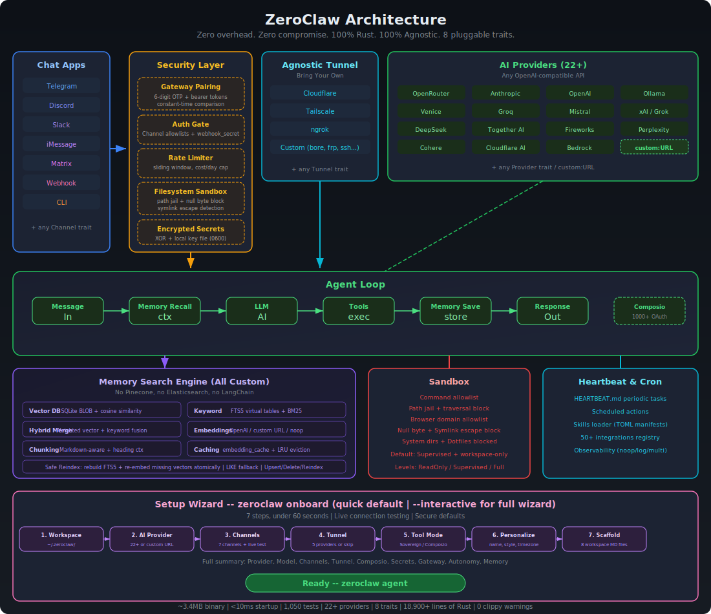

<p align="center">
  
</p>

<h1 align="center">ZeroClaw 🦀（Русский）</h1>

<p align="center">
  <strong>Zero overhead. Zero compromise. 100% Rust. 100% Agnostic.</strong>
</p>

<p align="center">
  <a href="LICENSE-APACHE"></a>
  <a href="NOTICE"></a>
  <a href="https://buymeacoffee.com/argenistherose"></a>
  <a href="https://x.com/zeroclawlabs?s=21"></a>
  <a href="https://zeroclawlabs.cn/group.jpg"></a>
  <a href="https://www.xiaohongshu.com/user/profile/67cbfc43000000000d008307?xsec_token=AB73VnYnGNx5y36EtnnZfGmAmS-6Wzv8WMuGpfwfkg6Yc%3D&xsec_source=pc_search"></a>
  <a href="https://t.me/zeroclawlabs"></a>
  <a href="https://www.facebook.com/groups/zeroclaw"></a>
  <a href="https://www.reddit.com/r/zeroclawlabs/"></a>
</p>

<p align="center">
  🌐 Языки:
  <a href="README.md">🇺🇸 English</a> ·
  <a href="README.zh-CN.md">🇨🇳 简体中文</a> ·
  <a href="README.ja.md">🇯🇵 日本語</a> ·
  <a href="README.ko.md">🇰🇷 한국어</a> ·
  <a href="README.vi.md">🇻🇳 Tiếng Việt</a> ·
  <a href="README.tl.md">🇵🇭 Tagalog</a> ·
  <a href="README.es.md">🇪🇸 Español</a> ·
  <a href="README.pt.md">🇧🇷 Português</a> ·
  <a href="README.it.md">🇮🇹 Italiano</a> ·
  <a href="README.de.md">🇩🇪 Deutsch</a> ·
  <a href="README.fr.md">🇫🇷 Français</a> ·
  <a href="README.ar.md">🇸🇦 العربية</a> ·
  <a href="README.hi.md">🇮🇳 हिन्दी</a> ·
  <a href="README.ru.md">🇷🇺 Русский</a> ·
  <a href="README.bn.md">🇧🇩 বাংলা</a> ·
  <a href="README.he.md">🇮🇱 עברית</a> ·
  <a href="README.pl.md">🇵🇱 Polski</a> ·
  <a href="README.cs.md">🇨🇿 Čeština</a> ·
  <a href="README.nl.md">🇳🇱 Nederlands</a> ·
  <a href="README.tr.md">🇹🇷 Türkçe</a> ·
  <a href="README.uk.md">🇺🇦 Українська</a> ·
  <a href="README.id.md">🇮🇩 Bahasa Indonesia</a> ·
  <a href="README.th.md">🇹🇭 ไทย</a> ·
  <a href="README.ur.md">🇵🇰 اردو</a> ·
  <a href="README.ro.md">🇷🇴 Română</a> ·
  <a href="README.sv.md">🇸🇪 Svenska</a> ·
  <a href="README.el.md">🇬🇷 Ελληνικά</a> ·
  <a href="README.hu.md">🇭🇺 Magyar</a> ·
  <a href="README.fi.md">🇫🇮 Suomi</a> ·
  <a href="README.da.md">🇩🇰 Dansk</a> ·
  <a href="README.nb.md">🇳🇴 Norsk</a>
</p>

<p align="center">
  <a href="install.sh">Установка в 1 клик</a> |
  <a href="docs/setup-guides/README.md">Быстрый старт</a> |
  <a href="docs/README.ru.md">Хаб документации</a> |
  <a href="docs/SUMMARY.md">TOC docs</a>
</p>

<p align="center">
  <strong>Быстрые маршруты:</strong>
  <a href="docs/reference/README.md">Справочники</a> ·
  <a href="docs/ops/README.md">Операции</a> ·
  <a href="docs/ops/troubleshooting.md">Диагностика</a> ·
  <a href="docs/security/README.md">Безопасность</a> ·
  <a href="docs/hardware/README.md">Аппаратная часть</a> ·
  <a href="docs/contributing/README.md">Вклад и CI</a>
</p>

> Этот файл — выверенный перевод `README.md` с акцентом на точность и читаемость (не дословный перевод).
>
> Технические идентификаторы (команды, ключи конфигурации, API-пути, имена Trait) сохранены на английском.
>
> Последняя синхронизация: **2026-02-19**.

## 📢 Доска объявлений

Публикуйте здесь важные уведомления (breaking changes, security advisories, окна обслуживания и блокеры релиза).

| Дата (UTC) | Уровень | Объявление | Действие |
|---|---|---|---|
| 2026-02-19 | _Срочно_ | Мы **не аффилированы** с `openagen/zeroclaw` и `zeroclaw.org`. Домен `zeroclaw.org` сейчас указывает на fork `openagen/zeroclaw`, и этот домен/репозиторий выдают себя за наш официальный сайт и проект. | Не доверяйте информации, бинарникам, сборам средств и «официальным» объявлениям из этих источников. Используйте только [этот репозиторий](https://github.com/zeroclaw-labs/zeroclaw) и наши верифицированные соцсети. |
| 2026-02-21 | _Важно_ | Наш официальный сайт уже запущен: [zeroclawlabs.ai](https://zeroclawlabs.ai). Спасибо, что дождались запуска. При этом попытки выдавать себя за ZeroClaw продолжаются, поэтому не участвуйте в инвестициях, сборах средств и похожих активностях, если они не подтверждены через наши официальные каналы. | Ориентируйтесь только на [этот репозиторий](https://github.com/zeroclaw-labs/zeroclaw); также следите за [X (@zeroclawlabs)](https://x.com/zeroclawlabs?s=21), [Telegram (@zeroclawlabs)](https://t.me/zeroclawlabs), [Facebook (группа)](https://www.facebook.com/groups/zeroclaw), [Reddit (r/zeroclawlabs)](https://www.reddit.com/r/zeroclawlabs/) и [Xiaohongshu](https://www.xiaohongshu.com/user/profile/67cbfc43000000000d008307?xsec_token=AB73VnYnGNx5y36EtnnZfGmAmS-6Wzv8WMuGpfwfkg6Yc%3D&xsec_source=pc_search) для официальных обновлений. |
| 2026-02-19 | _Важно_ | Anthropic обновил раздел Authentication and Credential Use 2026-02-19. В нем указано, что OAuth authentication (Free/Pro/Max) предназначена только для Claude Code и Claude.ai; использование OAuth-токенов, полученных через Claude Free/Pro/Max, в любых других продуктах, инструментах или сервисах (включая Agent SDK), не допускается и может считаться нарушением Consumer Terms of Service. | Чтобы избежать потерь, временно не используйте Claude Code OAuth-интеграции. Оригинал: [Authentication and Credential Use](https://code.claude.com/docs/en/legal-and-compliance#authentication-and-credential-use). |

## О проекте

ZeroClaw — это производительная и расширяемая инфраструктура автономного AI-агента. ZeroClaw — это **операционная система времени выполнения** для агентных рабочих процессов — инфраструктура, абстрагирующая модели, инструменты, память и выполнение, позволяя создавать агентов один раз и запускать где угодно.

- Нативно на Rust, единый бинарник, переносимость между ARM / x86 / RISC-V
- Архитектура на Trait (`Provider`, `Channel`, `Tool`, `Memory` и др.)
- Безопасные значения по умолчанию: pairing, явные allowlist, sandbox и scope-ограничения

## Почему выбирают ZeroClaw

- **Лёгкий runtime по умолчанию**: Повседневные CLI-операции и `status` обычно укладываются в несколько МБ памяти.
- **Оптимизирован для недорогих сред**: Подходит для бюджетных плат и небольших cloud-инстансов без тяжёлой runtime-обвязки.
- **Быстрый cold start**: Архитектура одного Rust-бинарника ускоряет запуск основных команд и daemon-режима.
- **Портативная модель деплоя**: Единый подход для ARM / x86 / RISC-V и возможность менять providers/channels/tools.

## Снимок бенчмарка (ZeroClaw vs OpenClaw, воспроизводимо)

Ниже — быстрый локальный сравнительный срез (macOS arm64, февраль 2026), нормализованный под 0.8GHz edge CPU.

| | OpenClaw | NanoBot | PicoClaw | ZeroClaw 🦀 |
|---|---|---|---|---|
| **Язык** | TypeScript | Python | Go | **Rust** |
| **RAM** | > 1GB | > 100MB | < 10MB | **< 5MB** |
| **Старт (ядро 0.8GHz)** | > 500s | > 30s | < 1s | **< 10ms** |
| **Размер бинарника** | ~28MB (dist) | N/A (скрипты) | ~8MB | **~8.8 MB** |
| **Стоимость** | Mac Mini $599 | Linux SBC ~$50 | Linux-плата $10 | **Любое железо за $10** |

> Примечание: результаты ZeroClaw получены на release-сборке с помощью `/usr/bin/time -l`. OpenClaw требует Node.js runtime; только этот runtime обычно добавляет около 390MB дополнительного потребления памяти. NanoBot требует Python runtime. PicoClaw и ZeroClaw — статические бинарники.

<p align="center">
  
</p>

### Локально воспроизводимое измерение

Метрики могут меняться вместе с кодом и toolchain, поэтому проверяйте результаты в своей среде:

```bash
cargo build --release
ls -lh target/release/zeroclaw

/usr/bin/time -l target/release/zeroclaw --help
/usr/bin/time -l target/release/zeroclaw status
```

Текущие примерные значения из README (macOS arm64, 2026-02-18):

- Размер release-бинарника: `8.8M`
- `zeroclaw --help`: ~`0.02s`, пик памяти ~`3.9MB`
- `zeroclaw status`: ~`0.01s`, пик памяти ~`4.1MB`

## Установка в 1 клик

```bash
git clone https://github.com/zeroclaw-labs/zeroclaw.git
cd zeroclaw
./install.sh
```

Для полной инициализации окружения: `./install.sh --install-system-deps --install-rust` (для системных пакетов может потребоваться `sudo`).

Подробности: [`docs/setup-guides/one-click-bootstrap.md`](docs/setup-guides/one-click-bootstrap.md).

## Быстрый старт

### Homebrew (macOS/Linuxbrew)

```bash
brew install zeroclaw
```

```bash
git clone https://github.com/zeroclaw-labs/zeroclaw.git
cd zeroclaw
cargo build --release --locked
cargo install --path . --force --locked

zeroclaw onboard --api-key sk-... --provider openrouter
zeroclaw onboard --interactive

zeroclaw agent -m "Hello, ZeroClaw!"

# default: 127.0.0.1:42617
zeroclaw gateway

zeroclaw daemon
```

## Subscription Auth (OpenAI Codex / Claude Code)

ZeroClaw поддерживает нативные профили авторизации на основе подписки (мультиаккаунт, шифрование при хранении).

- Файл хранения: `~/.zeroclaw/auth-profiles.json`
- Ключ шифрования: `~/.zeroclaw/.secret_key`
- Формат Profile ID: `<provider>:<profile_name>` (пример: `openai-codex:work`)

OpenAI Codex OAuth (подписка ChatGPT):

```bash
# Рекомендуется для серверов/headless-окружений
zeroclaw auth login --provider openai-codex --device-code

# Браузерный/callback-поток с paste-фолбэком
zeroclaw auth login --provider openai-codex --profile default
zeroclaw auth paste-redirect --provider openai-codex --profile default

# Проверка / обновление / переключение профиля
zeroclaw auth status
zeroclaw auth refresh --provider openai-codex --profile default
zeroclaw auth use --provider openai-codex --profile work
```

Claude Code / Anthropic setup-token:

```bash
# Вставка subscription/setup token (режим Authorization header)
zeroclaw auth paste-token --provider anthropic --profile default --auth-kind authorization

# Команда-алиас
zeroclaw auth setup-token --provider anthropic --profile default
```

Запуск agent с subscription auth:

```bash
zeroclaw agent --provider openai-codex -m "hello"
zeroclaw agent --provider openai-codex --auth-profile openai-codex:work -m "hello"

# Anthropic поддерживает и API key, и auth token через переменные окружения:
# ANTHROPIC_AUTH_TOKEN, ANTHROPIC_OAUTH_TOKEN, ANTHROPIC_API_KEY
zeroclaw agent --provider anthropic -m "hello"
```

## Архитектура

Каждая подсистема — это **Trait**: меняйте реализации через конфигурацию, без изменения кода.

<p align="center">
  
</p>

| Подсистема | Trait | Встроенные реализации | Расширение |
|-----------|-------|---------------------|------------|
| **AI-модели** | `Provider` | Каталог через `zeroclaw providers` (сейчас 28 встроенных + алиасы, плюс пользовательские endpoint) | `custom:https://your-api.com` (OpenAI-совместимый) или `anthropic-custom:https://your-api.com` |
| **Каналы** | `Channel` | CLI, Telegram, Discord, Slack, Mattermost, iMessage, Matrix, Signal, WhatsApp, Linq, Email, IRC, Lark, DingTalk, QQ, Webhook | Любой messaging API |
| **Память** | `Memory` | SQLite гибридный поиск, PostgreSQL-бэкенд, Lucid-мост, Markdown-файлы, явный `none`-бэкенд, snapshot/hydrate, опциональный кэш ответов | Любой persistence-бэкенд |
| **Инструменты** | `Tool` | shell/file/memory, cron/schedule, git, pushover, browser, http_request, screenshot/image_info, composio (opt-in), delegate, аппаратные инструменты | Любая функциональность |
| **Наблюдаемость** | `Observer` | Noop, Log, Multi | Prometheus, OTel |
| **Runtime** | `RuntimeAdapter` | Native, Docker (sandbox) | Через adapter; неподдерживаемые kind завершаются с ошибкой |
| **Безопасность** | `SecurityPolicy` | Gateway pairing, sandbox, allowlist, rate limits, scoping файловой системы, шифрование секретов | — |
| **Идентификация** | `IdentityConfig` | OpenClaw (markdown), AIEOS v1.1 (JSON) | Любой формат идентификации |
| **Туннели** | `Tunnel` | None, Cloudflare, Tailscale, ngrok, Custom | Любой tunnel-бинарник |
| **Heartbeat** | Engine | HEARTBEAT.md — периодические задачи | — |
| **Навыки** | Loader | TOML-манифесты + SKILL.md-инструкции | Пакеты навыков сообщества |
| **Интеграции** | Registry | 70+ интеграций в 9 категориях | Плагинная система |

### Поддержка runtime (текущая)

- ✅ Поддерживается сейчас: `runtime.kind = "native"` или `runtime.kind = "docker"`
- 🚧 Запланировано, но ещё не реализовано: WASM / edge-runtime

При указании неподдерживаемого `runtime.kind` ZeroClaw завершается с явной ошибкой, а не молча откатывается к native.

### Система памяти (полнофункциональный поисковый движок)

Полностью собственная реализация, ноль внешних зависимостей — без Pinecone, Elasticsearch, LangChain:

| Уровень | Реализация |
|---------|-----------|
| **Векторная БД** | Embeddings хранятся как BLOB в SQLite, поиск по косинусному сходству |
| **Поиск по ключевым словам** | Виртуальные таблицы FTS5 со скорингом BM25 |
| **Гибридное слияние** | Пользовательская взвешенная функция слияния (`vector.rs`) |
| **Embeddings** | Trait `EmbeddingProvider` — OpenAI, пользовательский URL или noop |
| **Чанкинг** | Построчный Markdown-чанкер с сохранением заголовков |
| **Кэширование** | Таблица `embedding_cache` в SQLite с LRU-вытеснением |
| **Безопасная переиндексация** | Атомарная перестройка FTS5 + повторное встраивание отсутствующих векторов |

Agent автоматически вспоминает, сохраняет и управляет памятью через инструменты.

```toml
[memory]
backend = "sqlite"             # "sqlite", "lucid", "postgres", "markdown", "none"
auto_save = true
embedding_provider = "none"    # "none", "openai", "custom:https://..."
vector_weight = 0.7
keyword_weight = 0.3
```

## Важные security-дефолты

- Gateway по умолчанию: `127.0.0.1:42617`
- Pairing обязателен по умолчанию: `require_pairing = true`
- Публичный bind запрещён по умолчанию: `allow_public_bind = false`
- Семантика allowlist каналов:
  - `[]` => deny-by-default
  - `["*"]` => allow all (используйте осознанно)

## Пример конфигурации

```toml
api_key = "sk-..."
default_provider = "openrouter"
default_model = "anthropic/claude-sonnet-4-6"
default_temperature = 0.7

[memory]
backend = "sqlite"
auto_save = true
embedding_provider = "none"

[gateway]
host = "127.0.0.1"
port = 42617
require_pairing = true
allow_public_bind = false
```

## Навигация по документации

- Хаб документации (English): [`docs/README.md`](docs/README.md)
- Единый TOC docs: [`docs/SUMMARY.md`](docs/SUMMARY.md)
- Хаб документации (Русский): [`docs/README.ru.md`](docs/README.ru.md)
- Справочник команд: [`docs/reference/cli/commands-reference.md`](docs/reference/cli/commands-reference.md)
- Справочник конфигурации: [`docs/reference/api/config-reference.md`](docs/reference/api/config-reference.md)
- Справочник providers: [`docs/reference/api/providers-reference.md`](docs/reference/api/providers-reference.md)
- Справочник channels: [`docs/reference/api/channels-reference.md`](docs/reference/api/channels-reference.md)
- Операционный runbook: [`docs/ops/operations-runbook.md`](docs/ops/operations-runbook.md)
- Устранение неполадок: [`docs/ops/troubleshooting.md`](docs/ops/troubleshooting.md)
- Инвентарь и классификация docs: [`docs/maintainers/docs-inventory.md`](docs/maintainers/docs-inventory.md)
- Снимок triage проекта: [`docs/maintainers/project-triage-snapshot-2026-02-18.md`](docs/maintainers/project-triage-snapshot-2026-02-18.md)

## Вклад и лицензия

- Contribution guide: [`CONTRIBUTING.md`](CONTRIBUTING.md)
- PR workflow: [`docs/contributing/pr-workflow.md`](docs/contributing/pr-workflow.md)
- Reviewer playbook: [`docs/contributing/reviewer-playbook.md`](docs/contributing/reviewer-playbook.md)
- License: MIT or Apache 2.0 ([`LICENSE-MIT`](LICENSE-MIT), [`LICENSE-APACHE`](LICENSE-APACHE), [`NOTICE`](NOTICE))

---

Для полной и исчерпывающей информации (архитектура, все команды, API, разработка) используйте основной английский документ: [`README.md`](README.md).
