# ZeroClaw Architecture Diagrams

This document provides visual representations of ZeroClaw's architecture, execution modes, and data flows.

---

## 1. Execution Modes

**Ways ZeroClaw can be run:**

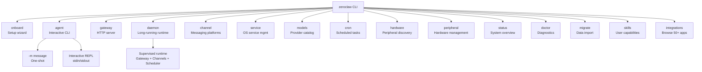

---

## 2. System Architecture Overview

**High-level component structure:**

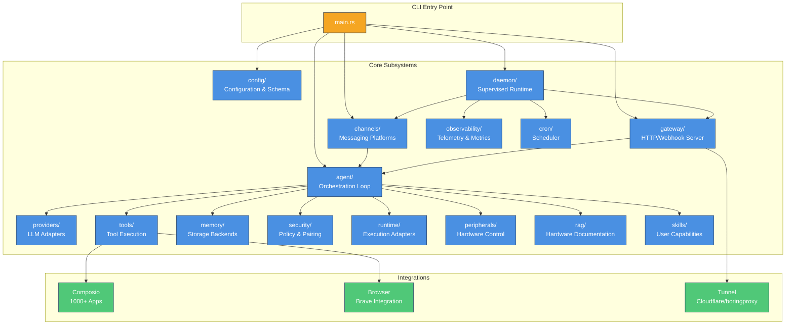

---

## 3. Message Flow Through The System

**How a user message becomes a response:**

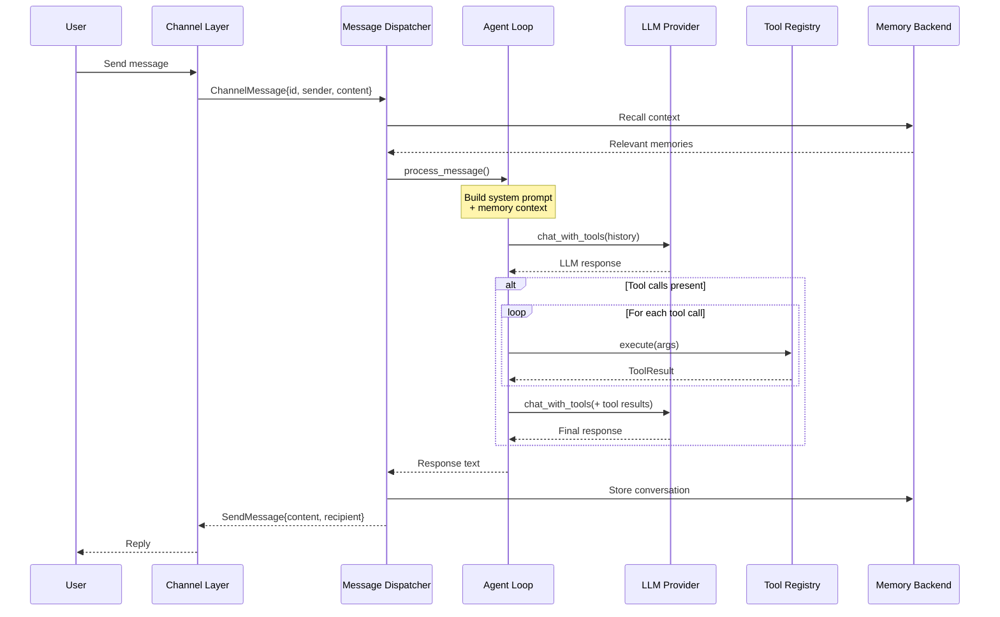

---

## 4. Agent Loop Execution Flow

**The core agent orchestration loop:**

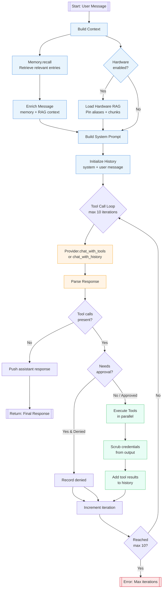

---

## 5. Daemon Supervision Model

**How the daemon keeps components alive:**

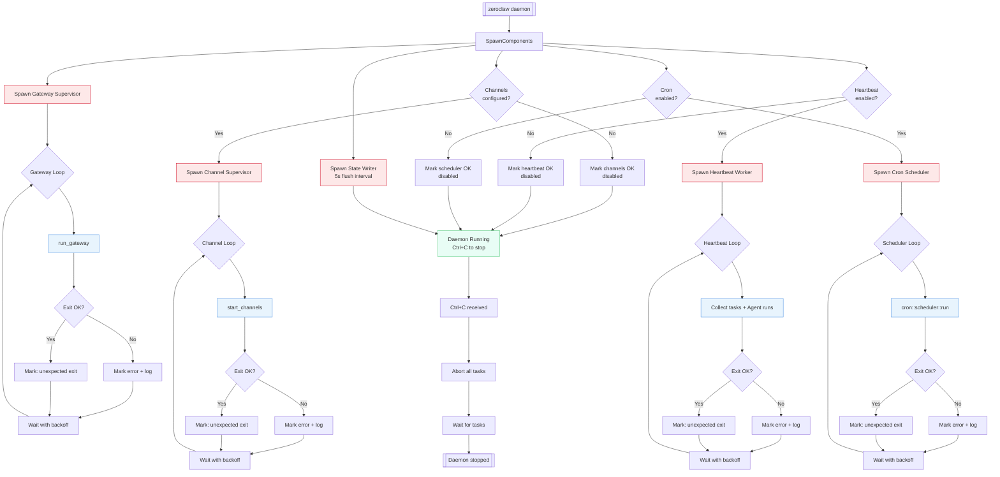

---

## 6. Gateway HTTP Endpoints

**The gateway's HTTP API structure:**

```mermaid
flowchart TB
    Client[HTTP Client] --> Gateway[ZeroClaw Gateway]

    Gateway --> PairPOST[POST /pair<br/>Exchange one-time code<br/>for bearer token]
    Gateway --> HealthGET[GET /health<br/>Status check]
    Gateway --> WebhookPOST[POST /webhook<br/>Main agent endpoint]
    Gateway --> WAVerify[GET /whatsapp<br/>Meta verification]
    Gateway --> WAMessage[POST /whatsapp<br/>WhatsApp webhook]

    PairPOST --> PairLimiter[Rate Limiter<br/>pair req/min]
    PairLimiter --> PairGuard[PairingGuard<br/>Code validation]
    PairGuard --> PairResponse[{paired, token, persisted}]

    WebhookPOST --> WebhookLimiter[Rate Limiter<br/>webhook req/min]
    WebhookLimiter --> WebhookPairing{Pairing<br/>required?}
    WebhookPairing -->|Yes| BearerAuth[Bearer token check]
    WebhookPairing -->|No| WebhookSecret{Secret<br/>configured?}
    WebhookSecret -->|Yes| SecretCheck[X-Webhook-Secret<br/>HMAC-SHA256 verify]
    WebhookSecret -->|No| Idempotency[Idempotency check<br/>X-Idempotency-Key]
    BearerAuth --> Idempotency
    SecretCheck --> Idempotency

    Idempotency --> MemoryStore[Auto-save to memory]
    MemoryStore --> ProviderCall[Provider.simple_chat]
    ProviderCall --> WebhookResponse[{response, model}]

    WAVerify --> TokenCheck[verify_token check<br/>constant-time compare]
    TokenCheck --> Challenge[Return hub.challenge]

    WAMessage --> SignatureCheck[X-Hub-Signature-256<br/>HMAC-SHA256 verify]
    SignatureCheck --> ParsePayload[Parse messages]
    ParsePayload --> ForEach[For each message]
    ForEach --> WAMemory[Auto-save to memory]
    WAMemory --> WAProvider[Provider.simple_chat]
    WAProvider --> WASend[WhatsAppChannel.send]

    classDef auth fill:#FDE8E8,stroke:#D0021B
    classDef processing fill:#E8F4FD,stroke:#4A90E2
    classDef response fill:#E8FDF5,stroke:#50C878

    class PairLimiter,PairGuard,BearerAuth,SecretCheck auth
    class MemoryStore,ProviderCall,TokenCheck,ParsePayload,ForEach,WAMemory,WAProvider processing
    class PairResponse,WebhookResponse,Challenge,WASend response
```

---

## 7. Channel Message Dispatch

**How channels route messages to the agent:**

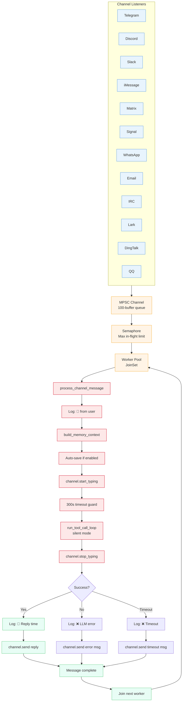

---

## 8. Memory System Architecture

**Storage backends and data flow:**

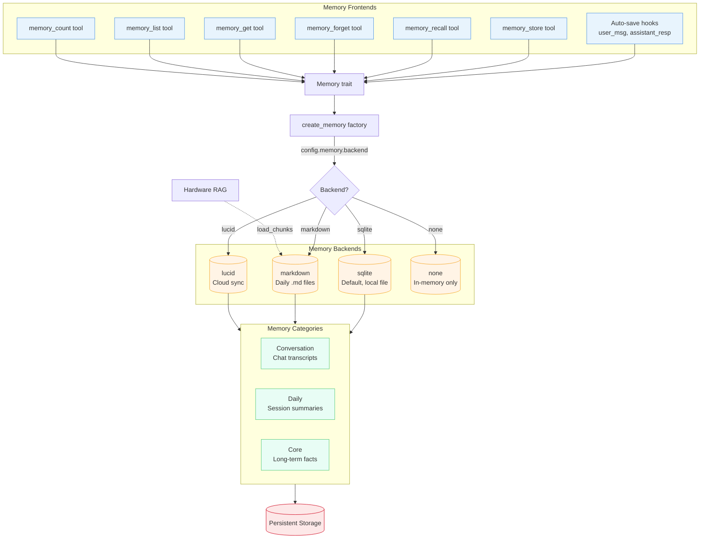

---

## 9. Provider and Model Routing

**LLM provider abstraction and routing:**

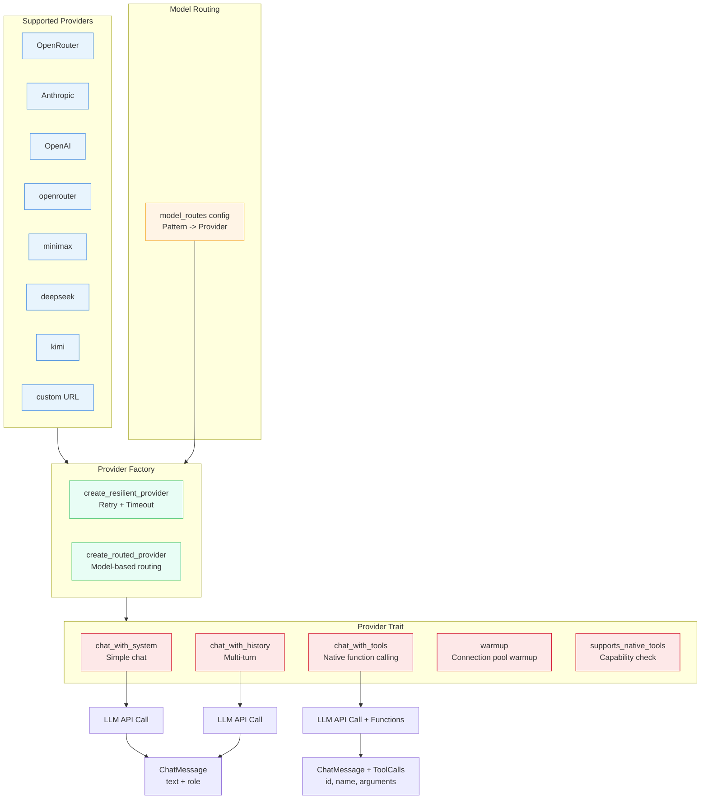

---

## 10. Tool Execution Architecture

**Tool registry, execution, and security:**

```mermaid
flowchart TB
    subgraph ToolCategories[Tool Categories]
        Core[Core Tools<br/>shell, file_read, file_write]
        Memory[Memory Tools<br/>store, recall, forget]
        Schedule[Schedule Tools<br/>cron_add, cron_list, etc.]
        Browser[Browser<br/>Brave integration]
        Composio[Composio<br/>1000+ app actions]
        Hardware[Hardware<br/>gpio_read, gpio_write,<br/>arduino_upload, etc.]
        Delegate[Delegate<br/>Sub-agent routing]
        Screenshot[screenshot<br/>Screen capture]
    end

    subgraph Registry[Tool Registry]
        AllTools[all_tools_with_runtime<br/>Factory function]
        DefaultTools[default_tools<br/>Base set]
        PeripheralTools[create_peripheral_tools<br/>Hardware-specific]
    end

    subgraph Security[Security Policy]
        AllowedCmds[allowed_commands<br/>Allowlist]
        WorkspaceOnly[workspace_only<br/>Path restriction]
        MaxActions[max_actions_per_hour<br/>Rate limit]
        MaxCost[max_cost_per_day_cents<br/>Cost cap]
        Approval[approval manager<br/>Supervised tools]
    end

    subgraph Execution[Tool Execution]
        Validate[Input validation<br/>Schema check]
        Approve{Approval<br/>needed?}
        Execute[execute async]
        Scrub[Scrub credentials<br/>from output]
        Result[ToolResult<br/>success, output, error]
    end

    ToolCategories --> Registry
    Registry --> Security
    Security --> Execution

    Validate --> Approve
    Approve -->|Yes| Prompt[Prompt CLI]
    Approve -->|No / Approved| Execute
    Approve -->|Denied| Denied[Return denied]

    Prompt --> UserChoice{User choice?}
    UserChoice -->|Yes| Execute
    UserChoice -->|No| Denied

    Execute --> Scrub
    Scrub --> Result
    Result --> Return[Return to agent loop]

    classDef tools fill:#E8F4FD,stroke:#4A90E2
    classDef registry fill:#FFF4E6,stroke:#F5A623
    classDef security fill:#FDE8E8,stroke:#D0021B
    classDef exec fill:#E8FDF5,stroke:#50C878

    class Core,Memory,Schedule,Browser,Composio,Hardware,Delegate,Screenshot tools
    class AllTools,DefaultTools,PeripheralTools registry
    class AllowedCmds,WorkspaceOnly,MaxActions,MaxCost,Approval security
    class Validate,Approve,Prompt,Execute,Scrub,Result,Return exec
```

---

## 11. Configuration Loading

**How configuration is loaded and merged:**

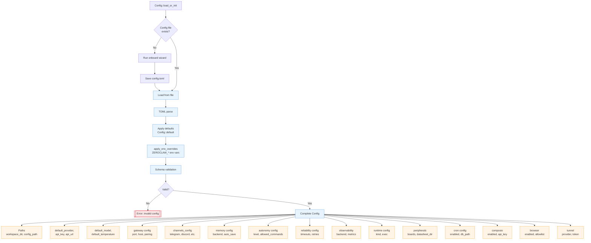

---

## 12. Hardware Peripherals Integration

**Hardware board support and control:**

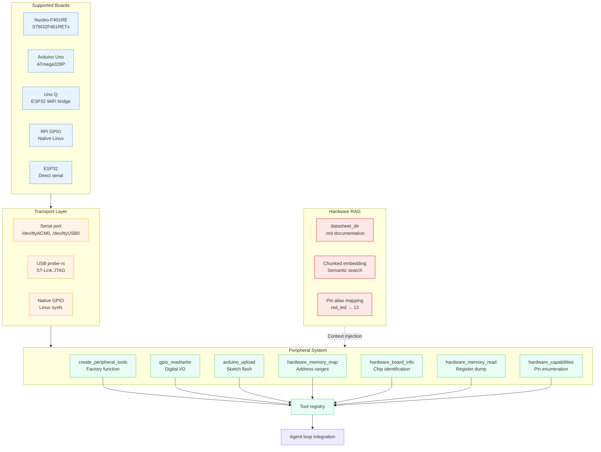

---

## 13. Observable Events

**Telemetry and observability flow:**

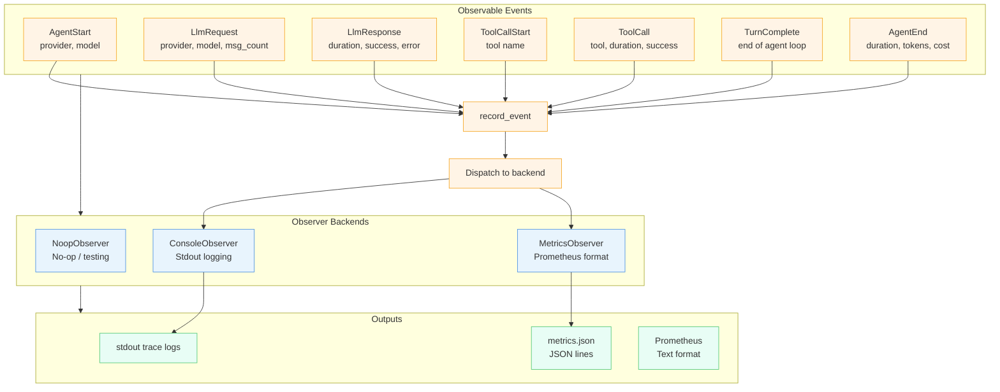

---

## Summary Diagram

**Quick reference overview:**

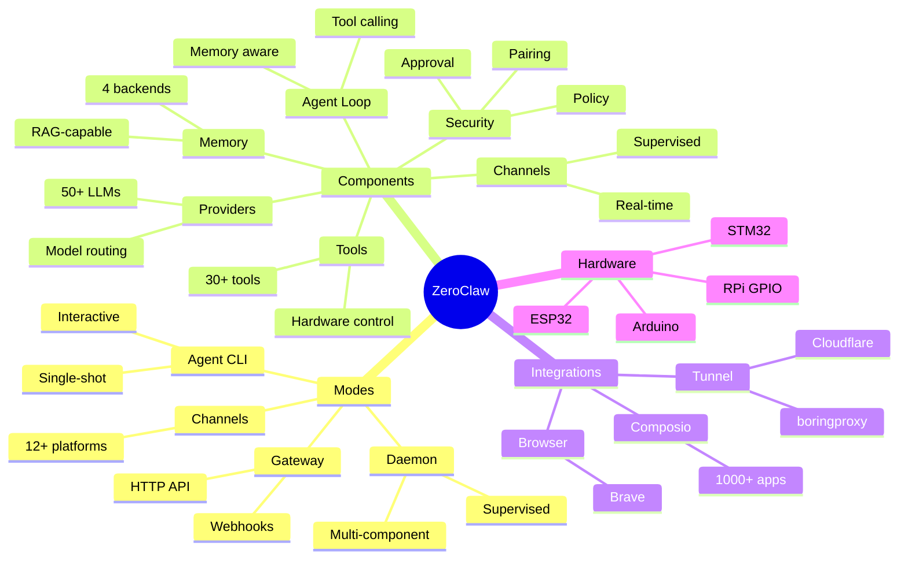

---

*Generated for ZeroClaw v0.1.0 - Architecture Documentation*
