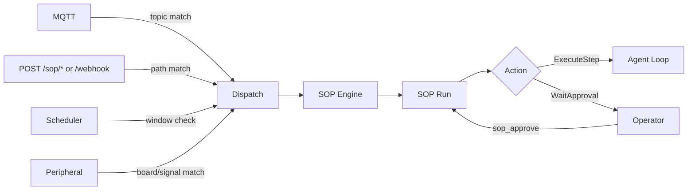

# Τυποποιημένες Διαδικασίες Λειτουργίας (SOP)

Οι SOPs είναι ντετερμινιστικές διαδικασίες που εκτελούνται από το `SopEngine`. Παρέχουν αντιστοίχιση ενεργοποιητών, πύλες έγκρισης και ελέγξιμη κατάσταση εκτέλεσης.

## Γρήγορα Μονοπάτια

- **Σύνδεση Συμβάντων:** [Συνδεσιμότητα & Fan-In](connectivity.md) — ενεργοποίηση SOPs μέσω MQTT, webhooks, cron ή περιφερειακών.
- **Συγγραφή SOPs:** [Αναφορά Σύνταξης](syntax.md) — απαιτούμενη διάταξη αρχείου και σύνταξη triggers/βημάτων.
- **Παρακολούθηση:** [Παρατηρησιμότητα & Έλεγχος](observability.md) — πού αποθηκεύεται η κατάσταση εκτέλεσης και οι εγγραφές ελέγχου.
- **Παραδείγματα:** [Cookbook](cookbook.md) — επαναχρησιμοποιήσιμα πρότυπα SOP.

## 1. Συμβόλαιο Χρόνου Εκτέλεσης (Τρέχον)

- Οι ορισμοί SOP φορτώνονται από `<workspace>/sops/<sop_name>/SOP.toml` συν προαιρετικό `SOP.md`.
- Το CLI `zeroclaw sop` διαχειρίζεται αυτή τη στιγμή μόνο ορισμούς: `list`, `validate`, `show`.
- Οι εκτελέσεις SOP ξεκινούν από event fan-in (MQTT/webhook/cron/περιφερειακό) ή από το εργαλείο `sop_execute` εντός agent.
- Η πρόοδος εκτέλεσης χρησιμοποιεί εργαλεία: `sop_status`, `sop_approve`, `sop_advance`.
- Οι εγγραφές ελέγχου SOP αποθηκεύονται στο ρυθμισμένο backend Μνήμης κάτω από την κατηγορία `sop`.

## 2. Ροή Συμβάντων



## 3. Ξεκινώντας

1. Ενεργοποίηση υποσυστήματος SOP στο `config.toml`:

   ```toml
   [sop]
   enabled = true
   sops_dir = "sops"  # προεπιλογή <workspace>/sops αν παραλειφθεί
   ```

2. Δημιουργήστε έναν κατάλογο SOP, για παράδειγμα:

   ```text
   ~/.zeroclaw/workspace/sops/deploy-prod/SOP.toml
   ~/.zeroclaw/workspace/sops/deploy-prod/SOP.md
   ```

3. Επαλήθευση και επιθεώρηση ορισμών:

   ```bash
   zeroclaw sop list
   zeroclaw sop validate
   zeroclaw sop show deploy-prod
   ```

4. Ενεργοποίηση εκτελέσεων μέσω ρυθμισμένων πηγών συμβάντων, ή χειροκίνητα από ένα turn agent με `sop_execute`.

Για λεπτομέρειες δρομολόγησης triggers και πιστοποίησης, δείτε [Συνδεσιμότητα](connectivity.md).
