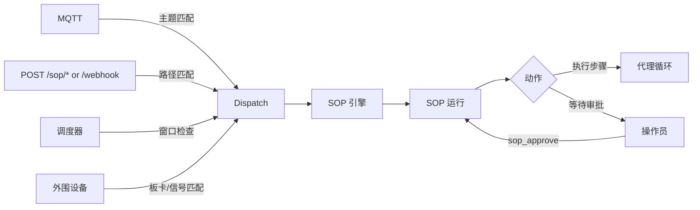

# 标准操作流程（SOP）

SOP 是由 `SopEngine` 执行的确定性流程。它们提供显式的触发器匹配、审批门控和可审计的运行状态。

## 快速路径

- **连接事件：** [连接与扇入](connectivity.zh-CN.md) — 通过 MQTT、webhook、cron 或外围设备触发 SOP。
- **编写 SOP：** [语法参考](syntax.zh-CN.md) — 所需的文件布局和触发器/步骤语法。
- **监控：** [可观测性与审计](observability.zh-CN.md) — 运行状态和审计条目的存储位置。
- **示例：** [食谱](cookbook.zh-CN.md) — 可复用的 SOP 模式。

## 1. 运行时契约（当前）

- SOP 定义从 `<workspace>/sops/<sop_name>/SOP.toml` 加载，外加可选的 `SOP.md`。
- CLI `zeroclaw sop` 当前仅管理定义：`list`、`validate`、`show`。
- SOP 运行由事件扇入（MQTT/webhook/cron/外围设备）或代理内工具 `sop_execute` 启动。
- 运行进度使用工具：`sop_status`、`sop_approve`、`sop_advance`。
- SOP 审计记录持久化在配置的内存后端的 `sop` 类别下。

## 2. 事件流程



## 3. 入门指南

1. 在 `config.toml` 中启用 SOP 子系统：

   ```toml
   [sop]
   enabled = true
   sops_dir = \"sops\"  # 省略时默认为 <workspace>/sops
   ```

2. 创建 SOP 目录，例如：

   ```text
   ~/.zeroclaw/workspace/sops/deploy-prod/SOP.toml
   ~/.zeroclaw/workspace/sops/deploy-prod/SOP.md
   ```

3. 验证和检查定义：

   ```bash
   zeroclaw sop list
   zeroclaw sop validate
   zeroclaw sop show deploy-prod
   ```

4. 通过配置的事件源触发运行，或在代理轮次中使用 `sop_execute` 手动触发。

有关触发器路由和认证详情，请参见 [连接](connectivity.zh-CN.md)。
