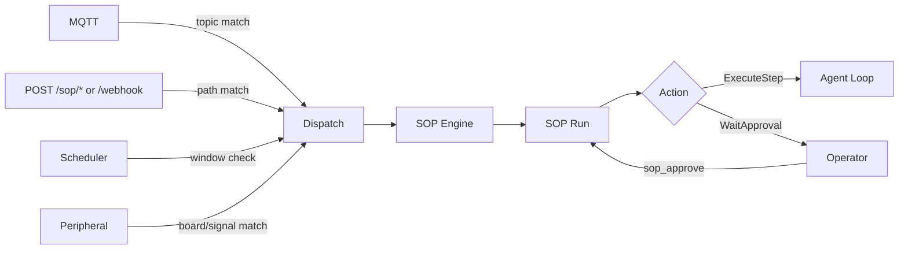

# Standard Operating Procedures (SOP)

SOPs are deterministic procedures executed by the `SopEngine`. They provide explicit trigger matching, approval gates, and auditable run state.

## Quick Paths

- **Connect Events:** [Connectivity & Fan-In](connectivity.md) — trigger SOPs via MQTT, webhooks, cron, or peripherals.
- **Write SOPs:** [Syntax Reference](syntax.md) — required file layout and trigger/step syntax.
- **Monitor:** [Observability & Audit](observability.md) — where run state and audit entries are stored.
- **Examples:** [Cookbook](cookbook.md) — reusable SOP patterns.

## 1. Runtime Contract (Current)

- SOP definitions are loaded from `<workspace>/sops/<sop_name>/SOP.toml` plus optional `SOP.md`.
- CLI `zeroclaw sop` currently manages definitions only: `list`, `validate`, `show`.
- SOP runs are started by event fan-in (MQTT/webhook/cron/peripheral) or by the in-agent tool `sop_execute`.
- Run progression uses tools: `sop_status`, `sop_approve`, `sop_advance`.
- SOP audit records are persisted in the configured Memory backend under category `sop`.

## 2. Event Flow



## 3. Getting Started

1. Enable SOP subsystem in `config.toml`:

   ```toml
   [sop]
   enabled = true
   sops_dir = "sops"  # defaults to <workspace>/sops when omitted
   ```

2. Create a SOP directory, for example:

   ```text
   ~/.zeroclaw/workspace/sops/deploy-prod/SOP.toml
   ~/.zeroclaw/workspace/sops/deploy-prod/SOP.md
   ```

3. Validate and inspect definitions:

   ```bash
   zeroclaw sop list
   zeroclaw sop validate
   zeroclaw sop show deploy-prod
   ```

4. Trigger runs via configured event sources, or manually from an agent turn with `sop_execute`.

For trigger routing and auth details, see [Connectivity](connectivity.md).
